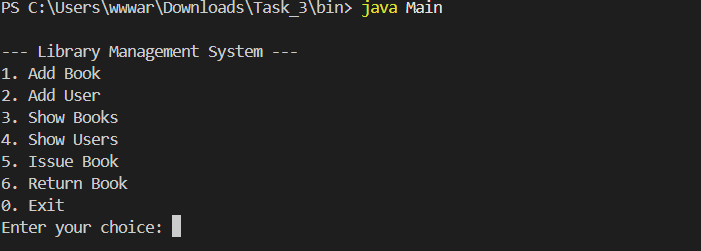
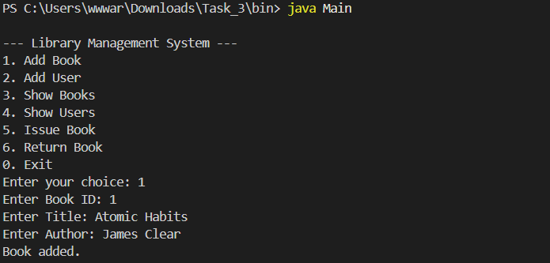
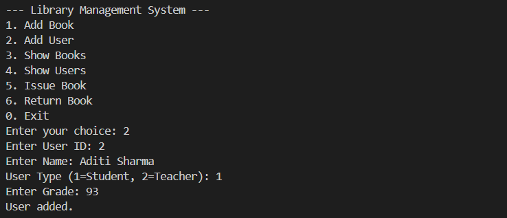
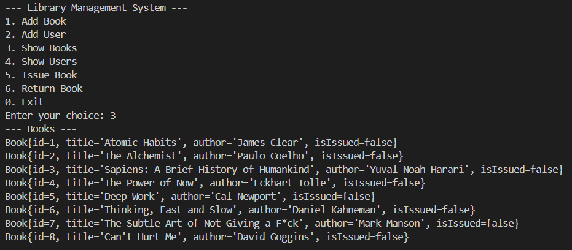
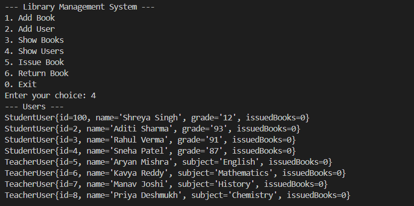
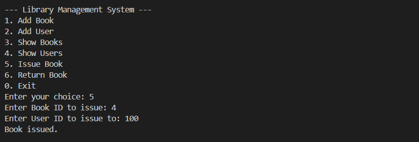
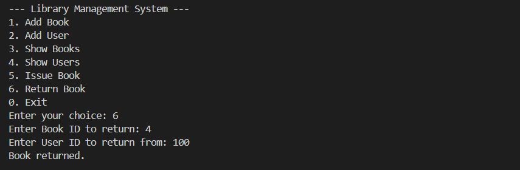
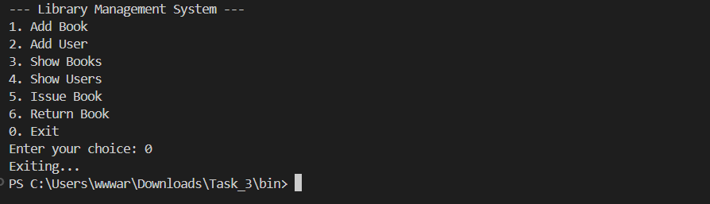

# Library Management System

## Overview
This is a simple console-based Library Management System implemented in Java using Object-Oriented Programming (OOP) principles. The system allows users to manage books and users, issue and return books, and demonstrates key OOP concepts such as abstraction, inheritance, and polymorphism.

## Features
- Add new books to the library
- Add new users (Student or Teacher)
- View all books and users
- Issue books to users
- Return books from users
- Interactive console menu

## OOP Concepts Demonstrated
- **Abstraction:** Classes like `Book`, `User`, and `Library` encapsulate data and behavior.
- **Inheritance:** `StudentUser` and `TeacherUser` extend the base `User` class.
- **Polymorphism:** Overridden `toString()` methods in subclasses for custom output.

## Project Structure
```
library-management-system/
├── src/           # Java source files (.java)
│   ├── Main.java
│   ├── Book.java
│   ├── User.java
│   ├── StudentUser.java
│   ├── TeacherUser.java
│   └── Library.java
├── bin/           # Compiled class files (.class)
├── screenshots/   # Screenshots for documentation
│   ├── main_menu.png
│   ├── add_book.png
│   ├── add_user.png
│   ├── show_books.png
│   ├── show_users.png
│   ├── issue_book.png
│   ├── return_book.png
│   └── exit.png
└── README.md      # Project documentation
```

## How to Run
1. **Compile the source files:**
   - Open a terminal in the `src` directory.
   - Run: `javac -d ../bin Main.java Library.java Book.java User.java StudentUser.java TeacherUser.java`
2. **Run the program:**
   - Change to the `bin` directory: `cd ../bin`
   - Run: `java Main`
3. **Use the menu:**
   - Follow the on-screen prompts to add books/users, issue/return books, and view lists.

## Screenshots
Below are example screenshots demonstrating various features of the Library Management System.

### Main Menu
<br><br>
*Shows the initial menu options available to the user for managing the library system.*

### Add Book
<br><br>
*Demonstrates the process of adding a new book by entering its ID, title, and author.*

### Add User
<br><br>
*Shows how to add a new user, including selecting the user type (Student or Teacher) and entering details.*

### Show Books
<br><br>
*Displays the list of all books currently available in the library.*

### Show Users
<br><br>
*Displays the list of all users registered in the library system.*

### Issue Book
<br><br>
*Shows the process of issuing a book to a user by entering the relevant IDs.*

### Return Book
<br><br>
*Demonstrates how a user can return a previously issued book to the library.*

### Exit Option
<br><br>
*Shows the exit option selected by the user, which safely terminates the application.*